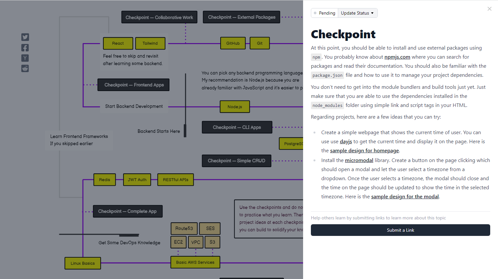

# Дорожные карты разработчика

Большой набор дорожных карт разработчика с детально расписанными шагами и рекомендациями для изучения по каждому шагу.

На [roadmap.sh](https://roadmap.sh/) доступны различные дорожные карты, такие как:

- [Frontend Developer](https://roadmap.sh/frontend)
- [Backend Developer](https://roadmap.sh/backend)
- [AI and Data Scientist Roadmap](https://roadmap.sh/ai-data-scientist)
- [Full Stack Developer](https://roadmap.sh/full-stack)
- [UX Design](https://roadmap.sh/ux-design)
- [React Developer](https://roadmap.sh/react)
- [System Design](https://roadmap.sh/system-design)
- [Design System](https://roadmap.sh/design-system)
- [MongoDB Roadmap](https://roadmap.sh/mongodb)

и другие...
