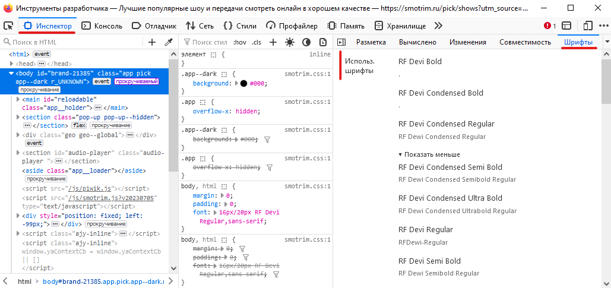
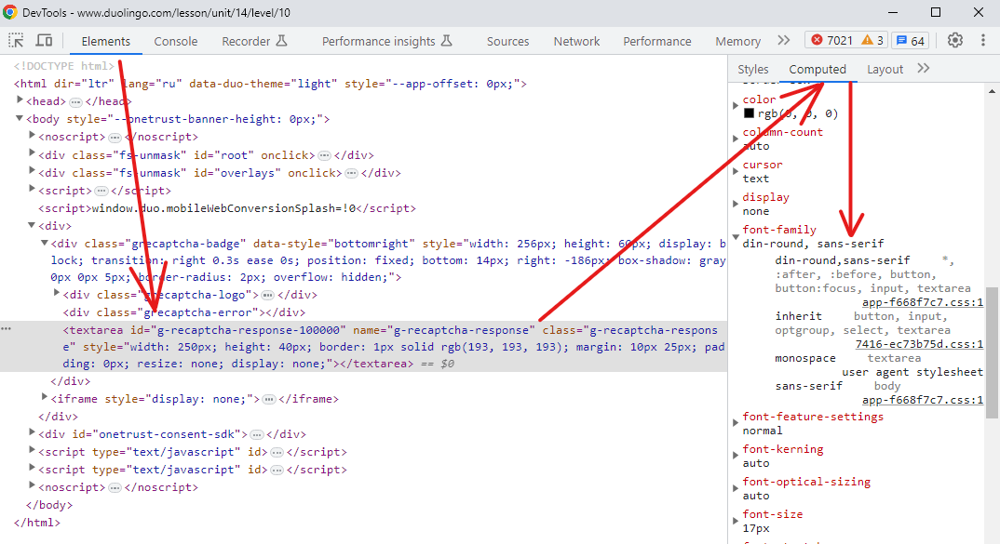
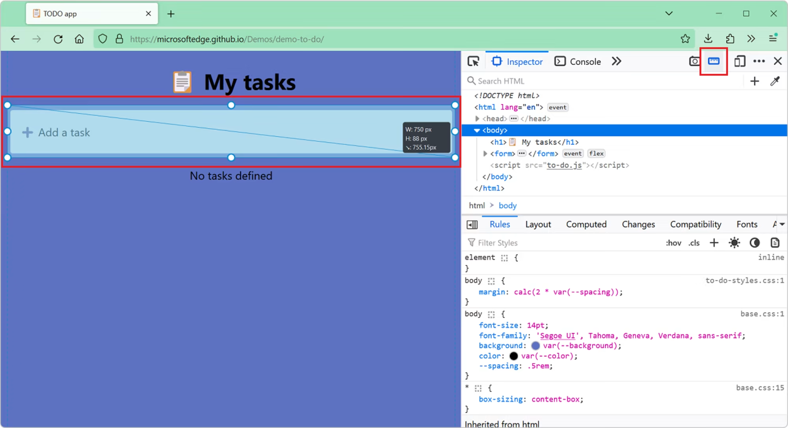

## 🔍 Изменение масштаба страницы инструментов разработчика

1. Фокус на DevTools (Chrome)
2. **Ctrl+** - Zoom in / **Ctrl-**  - Zoom out (Для MacOS - **Cmd**)

## ❌ Удаление элементов разметки со страницы

1. Фокус на DevTools (Chrome)
2.1.Выбрать вкладку **Elements**
2.2. Нажать на кнопку выбора элементов на странице (или **Ctrl+Shift+C** / **Cmd+Shift+C** для MacOS)
3. Выбрать элемент в дереве элементов
4. Нажать **Delete**

## 📄 Просмотр списка шрифтов используемых на странице

_Может пригодиться для выяснения названия понравившегося шрифта или в целях отладки (есть ли наш шрифт на странице или нет)._

**Firefox:**

1. Открыть вкладку **Inspector**
2. На панели внизу (или справа - в зависимости от компоновки страницы) выбрать вкладку **Fonts** (Будут указан все шрифты на странице) 

**Chrome, Edge, Brave или Opera:**

1. Выбрать элемент с текстом
2. Выбрать вкладку **Computed**
3. Прокрутить страницу вниз для просмотра отрисованных шрифтов 

## 📏 Измерение произвольных расстояний на странице

**Firefox:**

1. Включить инструмент. Перейти в инструменты разработчика -> нажать F1 для открытия настроек -> в **Available Toolbox Buttons** выбрать **Measure a portion of the page**
2. На любой странице в инструментах разработчика нажать на кнопку **Measure a portion of the page**
3. На странице отметить область которую надо измерить (нажать ЛКМ и протянуть). 

## 🎬 Управление воспроизведением видео из инструментов разработчика

_Может быть болезным, если нужно остановить воспроизведение видео или изменить его скорость_

**Chrome (возможно и в других):**

1. Открыть инструменты разработчика
2. кликнуть по элементу с текстом
3. в консоли написать _$0.playbackRate=2_ - для увеличения скорости воспроизведения в 2 раза.

Некоторые другие опции:
- _$0.play()_ - начать воспроизведение
- _$0.pause()_ - остановить воспроизведение
- _$0.loop()_ - зациклить воспроизведение

## 💅 Копирование стилей элемента

**Chrome, Edge, и другие Chromium-based браузеры**

1. Выбрать элемент во вкладке **Elements**
2. В контекстном меню выбрать **Copy**, в выпадающем списке выбрать **Copy styles**

## 🎴 Загрузка всех изображений на странице

_Код, представленный здесь, безусловно может быть улучшен. Данный код может быть выполнен в любом браузере, где разрешено выполнение JavaScript_

```
$$('img').forEach(async (img) => {
 try {
   const src = img.src;
   // Загрузить все изображения как blob.
   const fetchResponse = await fetch(src);
   const blob = await fetchResponse.blob();
   const mimeType = blob.type;
   // Генерируем имя файлов
   const start = src.lastIndexOf('/') + 1;
   const end = src.indexOf('.', start);
   let name = src.substring(start, end === -1 ? undefined : end);
   name = name.replace(/[^a-zA-Z0-9]+/g, '-');
   name += '.' + mimeType.substring(mimeType.lastIndexOf('/') + 1);
   // Скачиваем blob используя <a> элемент.
   const a = document.createElement('a');
   a.setAttribute('href', URL.createObjectURL(blob));
   a.setAttribute('download', name);
   a.click();
 } catch (e) {}
});
```

В Firefox загрузка может быть выполнена проще:

1. Нажать **Ctrl + I** для открытия **Page Info**
2. Зайти в **Media** и выбрать **Save As** для загрузки всех изображений

## 📝 Редактирование и повторная отправка запросов

_Может пригодиться для отладки запросов_

**Firefox:**

1. Открыть вкладку **Сеть**
2. Выбрать нужный запрос, вызвать контекстное меню в котором выбрать **Edit and Resend**
3. В развернувшемся окне сделать изменения для отправки запроса и нажать на кнопку **Send**


