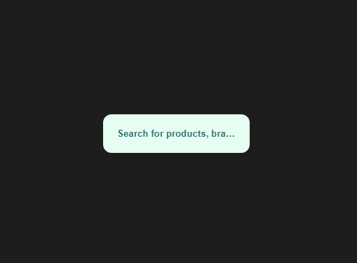

# Placeholder Truncation

<!-- [Ссылка на корневой README](../README.md) -->

Иногда текст плейсхолдера не помещается в поле элемента input и в этом случае он просто обрезается. Для того, что бы показать, что показан ен весь текст можно использовать _elipsis_ для _text-overflow_. После этого текст будет выглядеть как на картинке ниже:

Для запуска демонстрационного примера понадобится стартовать сервер, например это может быть расширение для VSCode - _Live Server_
